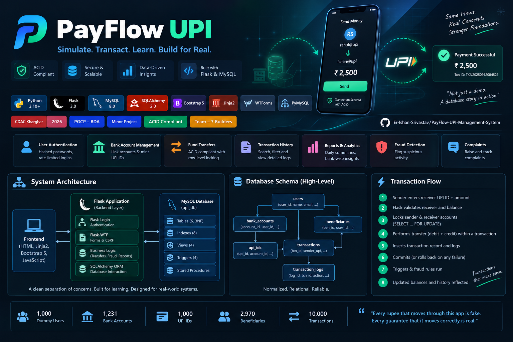
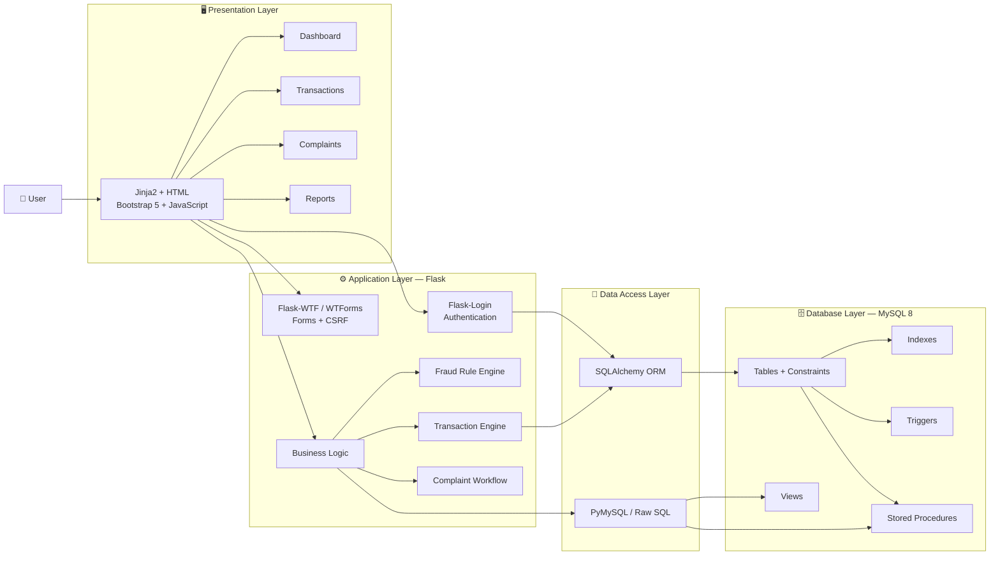
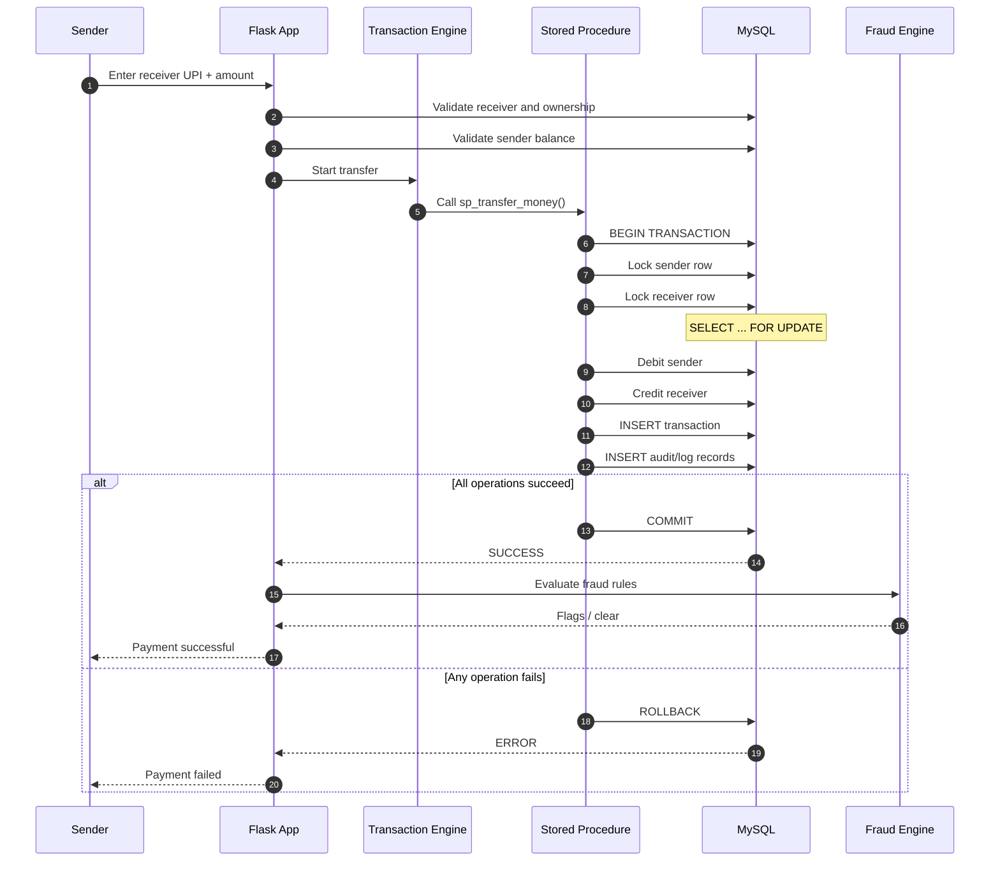
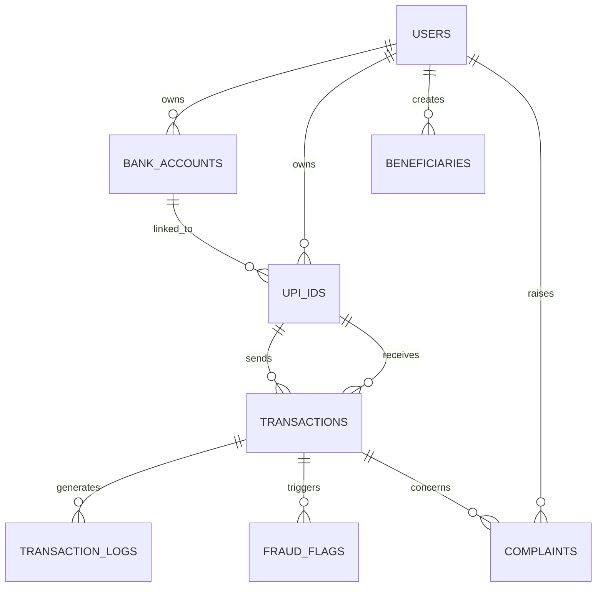

<div align="center">



# 💳 PayFlow UPI
### UPI Transaction Management System

> *"Every rupee that moves through this app is fake. Every guarantee that it moves correctly is real."*

**Simulate. Transact. Learn. Build for Real.**

A simulated UPI transaction platform built to demonstrate core DBMS concepts inside a working financial workflow — **ACID transactions, optimistic + row-level locking, relational modelling, triggers, views, stored procedures, authentication, fraud detection, complaints, and transaction analytics.**

<br>

`Python` · `Flask` · `MySQL 8` · `SQLAlchemy` · `PyMySQL` · `Bootstrap 5` · `Jinja2` · `WTForms` · `Chart.js`

<br>

[Overview](#-overview) • [Features](#-key-features) • [Architecture](#-system-architecture) • [Database](#-database-design) • [Transaction Flow](#-transaction-lifecycle) • [Setup](#-getting-started) • [Testing](#-testing)

</div>

---

## 📖 Overview

PayFlow is **simulated end to end** — dummy users, dummy bank accounts, dummy money, no real payment rails, and no real bank integration. That's a deliberate scope decision, not a shortcut: the goal is to prove out **relational database design, transaction handling, security, analytics, and DBMS concepts in a working system**, rather than to build a production fintech product.

### What it does

| | Capability | What it demonstrates |
|---|---|---|
| 🔐 | **User Authentication** | Hashed passwords, rate-limited login, sessions, CSRF protection |
| 🏦 | **Bank Account Management** | Account linking, ownership relationships, UPI mapping |
| 💳 | **UPI Management** | UPI ID creation, validation, and beneficiary workflows |
| 💸 | **Fund Transfers** | ACID debit/credit workflow with concurrency control |
| 🧾 | **Transaction History** | Search, filtering, status tracking, detailed audit history |
| 📊 | **Reports & Analytics** | Daily summaries, bank-wise reports, user-level insights |
| 🛡️ | **Fraud Detection** | High-value, rapid-fire, and repeated-failure rules |
| 💬 | **Complaints** | Raise, track, and manage transaction-related complaints |

### Project Philosophy

> **Not just a CRUD app. A database story in action.**

The project turns lecture-slide DBMS concepts into workflows that can actually be demonstrated: a user logs in, links an account, creates a UPI ID, sends simulated money, triggers transaction processing, generates audit records, and then explores the resulting data through reports and analytics.

---

## 🚀 Key Features

### 🔐 Secure Authentication
- Password hashing
- Rate-limited login attempts
- Session-based authentication
- CSRF-protected forms
- Secure user workflows

### 🏦 Bank & UPI Management
- Link simulated bank accounts
- Mint UPI IDs against bank accounts
- Manage beneficiaries
- Validate UPI relationships and ownership
- Enforce relational constraints

### ⚡ ACID Transaction Engine
- `START TRANSACTION`
- Sender debit + receiver credit
- `COMMIT` on success
- `ROLLBACK` on failure
- Row-level locking
- Optimistic concurrency using a `version` column
- Transaction logging and status tracking

### 🛡️ Fraud Detection
- High-value transaction detection
- Rapid-fire transaction detection
- Repeated-failure detection
- Fraud flags connected to transaction history

### 📊 Analytics & Reporting
- Daily transaction summaries
- Bank-wise balance reports
- User-level transaction summaries
- SQL aggregation, joins, CTEs and window functions
- Dashboard-ready reporting views

### 💬 Complaints
- Raise complaints against transactions
- Track complaint status
- Link complaints to users and transactions
- Support future admin/triage workflows

---

## 🏗️ System Architecture



### Architectural Principle

**Presentation → Application → Data Access → Database**

Each layer has a clear responsibility. The dashboard does not directly manipulate database tables, while database-side objects such as **views, triggers, constraints, and stored procedures** keep important DBMS logic close to the data.

This separation also makes parallel team development easier by giving each contributor a defined ownership boundary.

---

## 🔁 Transaction Lifecycle



### ACID Guarantee

The central invariant is simple:

> **A transfer either completes as a complete unit or it does not happen.**

If the debit succeeds but a later operation fails, the transaction is rolled back so the sender is not left debited without the corresponding receiver credit.

---

## 🗄️ Database Design



### DBMS Concepts → Implementation

| Concept | Implementation |
|---|---|
| **Normalization / 3NF** | `users`, `bank_accounts`, `upi_ids`, `beneficiaries`, `transactions`, `transaction_logs` and supporting entities |
| **ACID Transactions** | `sp_transfer_money` wrapped in transaction control with `COMMIT` / `ROLLBACK` |
| **Stored Procedures** | `sp_transfer_money`, `sp_register_user`, `sp_link_bank`, `sp_dashboard_summary` |
| **Triggers** | Transaction audit, transaction status changes, balance validation, beneficiary events |
| **Views** | `vw_user_profile`, `vw_transaction_history`, `vw_daily_summary`, `vw_bank_balance_report` |
| **Indexes** | UPI address, phone, email, sender/receiver UPI, timestamp, status, account number |
| **Constraints** | Foreign keys, unique constraints, `CHECK (balance >= 0)`, `CHECK (amount > 0)` |
| **Joins** | Sender/receiver relationships through UPI IDs, accounts and users |
| **Aggregation** | `SUM`, `COUNT`, `AVG`, `GROUP BY` for reporting |
| **Concurrency Control** | `version` column for optimistic locking + InnoDB row-level locking |
| **Fraud Detection** | Rules such as `high_value`, `rapid_fire`, `repeated_failures` writing to `fraud_flags` |
| **Auditability** | Transaction and status changes captured through database logging/triggers |

---

## 🧩 Database Objects

```text
upi_db
│
├── Tables
│   ├── users
│   ├── bank_accounts
│   ├── upi_ids
│   ├── beneficiaries
│   ├── transactions
│   ├── transaction_logs
│   ├── fraud_flags
│   └── complaints
│
├── Views
│   ├── vw_user_profile
│   ├── vw_transaction_history
│   ├── vw_daily_summary
│   └── vw_bank_balance_report
│
├── Triggers
│   ├── transaction insert audit
│   ├── transaction update audit
│   ├── balance validation
│   └── beneficiary audit
│
├── Stored Procedures
│   ├── sp_transfer_money
│   ├── sp_register_user
│   ├── sp_link_bank
│   └── sp_dashboard_summary
│
└── Indexes + Constraints
```

---

## 📊 By the Numbers

<div align="center">

| 👥 Dummy Users | 🏦 Bank Accounts | 💳 UPI IDs | 🤝 Beneficiaries | 🔁 Transactions |
|:---:|:---:|:---:|:---:|:---:|
| **1,000** | **1,231** | **1,000** | **2,970** | **10,000** |

</div>

The seeded dataset is intentionally large enough to make **reporting, indexing, transaction history, aggregation, and fraud-detection features meaningful during a demonstration**.

---

## 🛠️ Technology Stack

| Layer | Technology | Purpose |
|---|---|---|
| **Backend** | Flask 3 + Blueprints | Modular application layer |
| **ORM** | SQLAlchemy 2 + Flask-Migrate | Models, migrations, connection pooling |
| **Database** | MySQL 8.0 | Relational store and ACID transaction support |
| **DB Driver** | PyMySQL | MySQL connectivity for raw SQL/procedure workflows |
| **Auth** | Flask-Login + Werkzeug hashing | Session management and password security |
| **Forms** | Flask-WTF + WTForms | CSRF-protected forms |
| **Rate Limiting** | Flask-Limiter | Brute-force protection |
| **Frontend** | Jinja2 + Bootstrap 5 + Chart.js | Responsive UI and analytics dashboards |
| **Testing** | pytest + pytest-flask | Unit and integration testing |
| **Deployment** | Gunicorn + python-dotenv | Production-style application entrypoint |

> The project intentionally demonstrates both **application-layer ORM interaction** and **database-layer SQL objects**, allowing DBMS concepts to remain visible and testable rather than hiding everything behind application code.

---

## 📁 Repository Structure

```text
📦 upi-management-system
┣ 📂 app/
┃ ┣ 📜 __init__.py
┃ ┣ 📜 config.py
┃ ┣ 📂 models/
┃ ┃ ┣ 📜 user.py
┃ ┃ ┣ 📜 bank_account.py
┃ ┃ ┣ 📜 upi.py
┃ ┃ ┣ 📜 transaction.py
┃ ┃ ┗ 📜 beneficiary.py
┃ ┣ 📂 routes/
┃ ┃ ┣ 📜 auth.py
┃ ┃ ┣ 📜 dashboard.py
┃ ┃ ┣ 📜 account.py
┃ ┃ ┣ 📜 complaints.py
┃ ┃ ┗ 📜 transaction.py
┃ ┣ 📂 forms/
┃ ┣ 📂 templates/
┃ ┣ 📂 static/
┃ ┣ 📂 fraud/
┃ ┗ 📂 utils/
┣ 📂 database/
┃ ┣ 📜 schema.sql
┃ ┣ 📜 indexes.sql
┃ ┣ 📜 views.sql
┃ ┣ 📜 triggers.sql
┃ ┣ 📜 stored_procedures.sql
┃ ┗ 📜 seed_data.sql
┣ 📂 migrations/
┣ 📂 tests/
┣ 📂 assets/
┃ ┗ 🖼️ payflow-banner.png
┣ 📜 .env.example
┣ 📜 requirements.txt
┣ 📜 run.py
┗ 📜 README.md
```

---

## 📸 Screenshots / UI

> Add the strongest application screenshots here before final submission.

Recommended showcase sequence:

| # | Screenshot | What it demonstrates |
|---:|---|---|
| 01 | **Dashboard** | Balances, activity, charts and analytics |
| 02 | **Send Money** | Receiver validation + transfer workflow |
| 03 | **Transaction History** | Filtering, status and detailed logs |
| 04 | **Bank / UPI Management** | Linked accounts, UPI IDs and beneficiaries |
| 05 | **Reports** | Database-backed analytics |
| 06 | **Fraud / Complaints** | Exception and monitoring workflows |

---

## ⚙️ Getting Started

### Prerequisites

```bash
Python >= 3.10
MySQL 8.0+
Git
```

### 1. Clone & Set Up the Environment

```bash
git clone https://github.com/Er-Ishan-Srivastav/PayFlow-UPI-Management-System.git
cd PayFlow-UPI-Management-System

python -m venv venv
```

**Windows**

```bash
venv\Scripts\activate
```

**macOS / Linux**

```bash
source venv/bin/activate
```

Install dependencies:

```bash
pip install -r requirements.txt
```

### 2. Configure the Database

```bash
cp .env.example .env
```

Edit `.env` with the local MySQL credentials and database configuration.

### 3. Initialize Schema, Objects and Seed Data

Run the database files in order:

```bash
mysql -u root -p < database/schema.sql
mysql -u root -p upi_db < database/indexes.sql
mysql -u root -p upi_db < database/views.sql
mysql -u root -p upi_db < database/triggers.sql
mysql -u root -p upi_db < database/stored_procedures.sql
mysql -u root -p upi_db < database/seed_data.sql
```

> Database objects are created before seed data so that constraints, triggers, views and procedures are available during initialization.

### 4. Run the Application

```bash
python run.py
```

Then open:

```text
http://127.0.0.1:5000
```

---

## 🧪 Testing

Run the complete suite:

```bash
pytest tests/ -v
```

The testing strategy covers:

- Authentication success/failure
- Bank account workflows
- UPI creation and validation
- Successful transfers
- Failed transfers
- Insufficient-balance handling
- Transaction rollback
- Transaction logs
- Fraud rules
- Complaint workflows
- History filters and pagination
- Database-side objects
- Concurrency scenarios

---

## 👥 Team & Ownership

<div align="center">

`CDAC Kharghar` · `PGCP - BDA Minor Project` · `2026` · `Team of 7`

</div>

| Role | Member | Ownership | Focus |
|---|---|---|---|
| **#1 Database Lead** | Harsh Jadhav | `models/`, `schema.sql`, seed data, migrations, ERD | Schema, indexes, views |
| **#2 Auth & Core Backend** | Komal Londhe | App factory, config, auth blueprint, security | Login, rate-limiting, CSRF |
| **#3 Transaction Engine** | Hansal | Transaction routes + services | ACID, locking, send-money correctness |
| **#4 CRUD & Complaints** | Krunal | Account routes, UPI linking, complaints | Bank/UPI CRUD, complaint workflow |
| **#5 SQL Analytics** | Khushi Joshi | Analytics queries, views, reporting | Dashboard data feeds |
| **#6 Dashboard & Frontend** | Harshavardhan | Templates, static assets, Chart.js | UI + visualizations |
| **#7 Integration & QA** | Ishan Srivastav | Git workflow, fraud engine, tests, README | Integration, QA, end-to-end demo |

---

## 🔭 Where This Could Go Next

- [ ] Admin view over `fraud_flags` and `complaints` for triage
- [ ] QR-code UPI address sharing — cosmetic only, no real payment rail
- [ ] OTP-style second factor on login
- [ ] Dockerized one-command local setup
- [ ] CI pipeline for automated testing
- [ ] Performance benchmarking under concurrent transfers

---

## 📄 Citation

```bibtex
@project{payflow2026,
  title   = {PayFlow: A Simulated UPI Transaction System Demonstrating Core DBMS Concepts},
  author  = {Jadhav, Harsh and Londhe, Komal and Hansal and Krunal and Joshi, Khushi and Harshavardhan and Srivastav, Ishan},
  school  = {CDAC Kharghar, Navi Mumbai},
  year    = {2026},
  note    = {PGCP - BDA Minor Project}
}
```

---

<div align="center">

### 💳 PayFlow UPI

**Simulate. Transact. Learn. Build for Real.**

`UPI` · `Flask` · `MySQL` · `ACID Transactions` · `SQLAlchemy` · `Stored Procedures` · `Triggers` · `Views` · `Optimistic Concurrency` · `Fraud Detection` · `3NF`

<br>

*Built for learning. Designed like a real system.*

</div>
