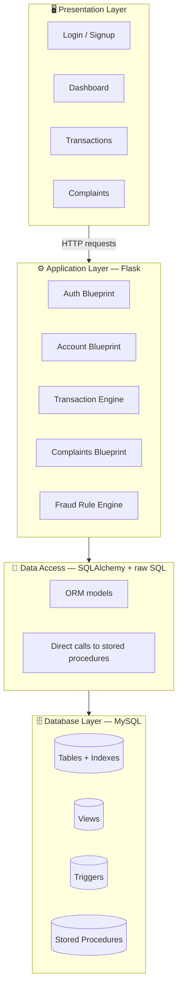
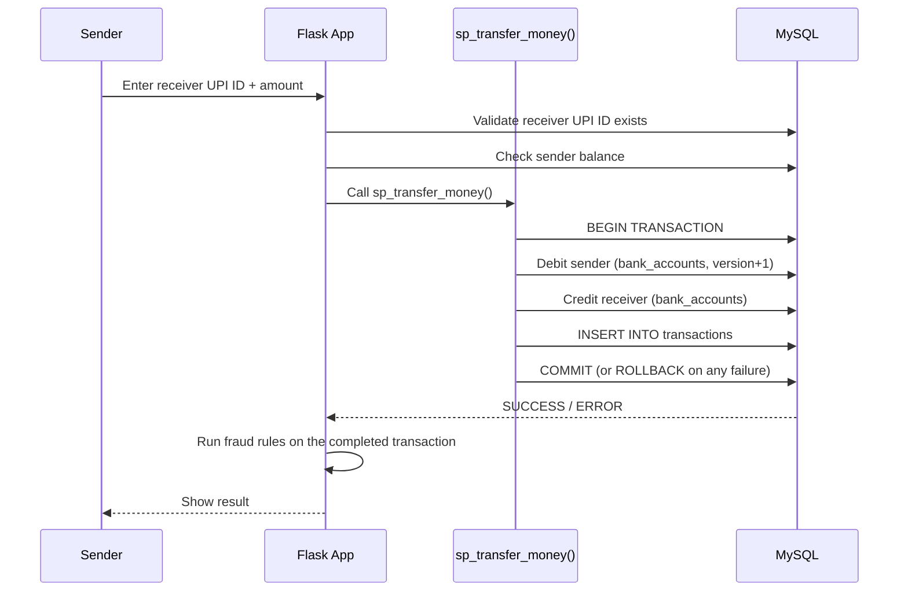
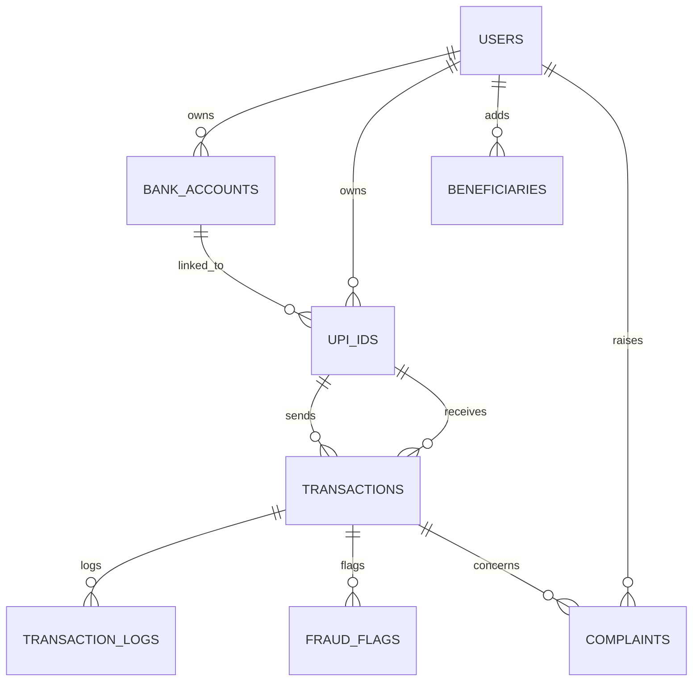

<div align="center">

# 💳 PayFlow
### UPI Transaction Management System

> *"Every rupee that moves through this app is fake. Every guarantee that it moves correctly is real."*

A simulated UPI transaction platform built to demonstrate core DBMS concepts inside a working financial workflow — ACID transactions, optimistic + row-level locking, relational modelling, triggers, views, stored procedures, authentication, and transaction analytics.

**Built with**
`Python` `Flask` `MySQL 8` `SQLAlchemy` `PyMySQL`

[Overview](#-overview) • [Features](#-key-features) • [Architecture](#-system-architecture) • [Database](#-database-design) • [Setup](#-getting-started) • [Testing](#-testing)

</div>

---

## 📖 Overview

PayFlow is **simulated** end to end — dummy users, dummy bank accounts, dummy money, no real payment rails, no real bank integration. That's a deliberate scope decision, not a shortcut: the goal is to prove out relational database design and transaction handling in a working system, not to build a fintech product.

What it actually does:
- 🔐 Register & log in with hashed passwords and rate-limited login attempts
- 🏦 Link bank accounts and mint UPI IDs against them
- 💸 Send money with genuine `BEGIN / COMMIT / ROLLBACK` guarantees — a failed transfer never leaves one account debited without the other credited
- 🧾 Raise and track complaints against a transaction
- 📊 Pull transaction history, daily summaries, and bank-wise reports straight from MySQL views
- 🛡️ Get flagged automatically for suspicious activity — large amounts, rapid-fire sends, repeated failures

---

## 🚀 Key Features

| | |
|---|---|
| **Secure Auth** | Password hashing, rate-limited login, CSRF-protected forms |
| **Real ACID Transfers** | Every rupee moved inside a genuine database transaction |
| **Optimistic Concurrency** | `version` column on `bank_accounts` prevents two simultaneous transfers from racing each other |
| **Fraud Detection** | Pluggable rule engine — high value, rapid-fire, repeated failures |
| **Full Audit Trail** | Every transaction and status change logged via triggers |
| **Analytics-Ready** | Daily volume, bank-wise balances, and per-user summaries via SQL views |

---

## 🏗 System Architecture



Each layer only talks to the one directly below it — the dashboard never touches SQL directly, and the database layer never talks back up to the templates. That separation is also what let seven people build this in parallel without stepping on each other's files.

---

## 🔁 Transaction Lifecycle



---

## 🗄 Database Design



### DBMS Concepts, Mapped to Actual Code

| Concept | Where it lives |
|---|---|
| **Normalization (3NF)** | `users`, `bank_accounts`, `upi_ids`, `beneficiaries`, `transactions`, `transaction_logs` — no repeated data anywhere |
| **ACID Transactions** | `sp_transfer_money` — wrapped in `START TRANSACTION` / `COMMIT`, rolls back on any failure |
| **Stored Procedures** | `sp_transfer_money`, `sp_register_user`, `sp_link_bank`, `sp_dashboard_summary` |
| **Triggers** | `trg_after_txn_insert`, `trg_after_txn_update`, `trg_before_balance_update`, `trg_after_beneficiary_add` |
| **Views** | `vw_user_profile`, `vw_transaction_history`, `vw_daily_summary`, `vw_bank_balance_report` |
| **Indexes** | On `upi_address`, `phone`, `email`, `sender_upi`, `receiver_upi`, `timestamp`, `status`, `account_no` |
| **Constraints** | FK on every reference, UNIQUE on email/phone/upi_address/account_no, `CHECK (balance >= 0)`, `CHECK (amount > 0)` |
| **Joins** | `vw_transaction_history` joins transactions → upi_ids → users, twice (sender + receiver) |
| **Aggregation** | `vw_daily_summary`, `vw_bank_balance_report` — `SUM`, `COUNT`, `AVG`, `GROUP BY` |
| **Concurrency Control** | `version` column on `bank_accounts` (optimistic locking) + InnoDB row-level locks |
| **Fraud Detection** | Rule engine (`high_value`, `rapid_fire`, `repeated_failures`) writing to `fraud_flags` |

---

## 🛠️ Technology Stack

| Layer | Technology | Purpose |
|---|---|---|
| **Backend** | Flask 3 + Blueprints | Modular application layer |
| **ORM** | SQLAlchemy 2 + Flask-Migrate | Models, migrations, connection pooling |
| **Database** | MySQL 8.0 | Relational store, full ACID support |
| **Auth** | Flask-Login + Werkzeug hashing | Session management & password security |
| **Forms** | Flask-WTF + WTForms | CSRF-protected forms |
| **Rate Limiting** | Flask-Limiter | Brute-force protection on login |
| **Frontend** | Jinja2 + Bootstrap 5 + Chart.js | Responsive UI + analytics dashboards |
| **Testing** | pytest + pytest-flask | Unit & integration tests |
| **Deployment** | Gunicorn + python-dotenv | Production-style entrypoint |

> The account/complaints routes call the MySQL stored procedures directly (raw SQL via PyMySQL) rather than going through the ORM — a deliberate choice so the procedures stay visible as first-class DBMS objects rather than being reimplemented as ORM logic.

---

## 📁 Repository Structure

```
📦 upi-management-system
┣ 📂 app/
┃ ┣ 📜 __init__.py                 # App factory + blueprint registration
┃ ┣ 📜 config.py                   # Configuration (dev/prod)
┃ ┣ 📂 models/                     # SQLAlchemy models (3NF)
┃ ┃ ┣ 📜 user.py
┃ ┃ ┣ 📜 bank_account.py
┃ ┃ ┣ 📜 upi.py
┃ ┃ ┣ 📜 transaction.py
┃ ┃ ┗ 📜 beneficiary.py
┃ ┣ 📂 routes/                     # Blueprints
┃ ┃ ┣ 📜 auth.py                   # Login / Register / Logout
┃ ┃ ┣ 📜 dashboard.py
┃ ┃ ┣ 📜 account.py                # Bank linking & UPI management
┃ ┃ ┣ 📜 complaints.py             # Raise / track / resolve
┃ ┃ ┗ 📜 transaction.py            # Send money + history
┃ ┣ 📂 forms/
┃ ┣ 📂 templates/                  # Jinja2 + Bootstrap
┃ ┣ 📂 static/                     # CSS / JS / images
┃ ┣ 📂 fraud/                      # Fraud rule engine
┃ ┗ 📂 utils/                      # Helpers (UPI validation, DB connection)
┣ 📂 database/
┃ ┣ 📜 schema.sql                  # Full DDL (tables, constraints)
┃ ┣ 📜 indexes.sql                 # Performance indexes
┃ ┣ 📜 views.sql                   # Reporting views
┃ ┣ 📜 triggers.sql                # Audit + validation triggers
┃ ┣ 📜 stored_procedures.sql       # Transfer, register, link, dashboard
┃ ┗ 📜 seed_data.sql               # Demo users + sample transactions
┣ 📂 migrations/                   # Flask-Migrate
┣ 📂 tests/
┣ 📜 .env.example
┣ 📜 requirements.txt
┣ 📜 run.py
┗ 📜 README.md
```

---

## 📸 Screenshots / UI

_Add dashboard, send-money, and history screenshots here before final submission — a quick visual anchor goes a long way in front of a mentor._

---

## ⚙️ Getting Started

### Prerequisites
```bash
Python >= 3.10
MySQL 8.0+
Git
```

### 1. Clone & Set Up the Environment
```bash
git clone https://github.com/YOUR_USERNAME/upi-management-system.git
cd upi-management-system

python -m venv venv
source venv/bin/activate          # Windows: venv\Scripts\activate
pip install -r requirements.txt
```

### 2. Configure the Database
```bash
cp .env.example .env
# Edit .env with your MySQL credentials
```

### 3. Initialize Schema, Objects, and Seed Data

Run these **in order** — later files depend on tables (and triggers) created by earlier ones:

```bash
mysql -u root -p < database/schema.sql
mysql -u root -p upi_db < database/indexes.sql
mysql -u root -p upi_db < database/views.sql
mysql -u root -p upi_db < database/triggers.sql
mysql -u root -p upi_db < database/stored_procedures.sql
mysql -u root -p upi_db < database/seed_data.sql
```

> Triggers must exist **before** `seed_data.sql` runs, or the seed inserts won't generate audit log rows.

### 4. Run the Application
```bash
python run.py
# Visit http://127.0.0.1:5000
```

---

## 🧪 Testing
```bash
pytest tests/ -v
```

---

## 👥 Team & Ownership

<div align="center">

`CDAC Kharghar` · `PGCP - BDA Minor Project` · `2026` · `Team of 7`

</div>

| Role | Member | Owns | Focus |
|---|---|---|---|
| **#1 Database Lead** | Harsh Jadhav | `models/`, `schema.sql`, seed data, migrations, ERD | Schema, indexes, views |
| **#2 Auth & Core Backend** | Komal Londhe | App factory, config, auth blueprint, security | Login, rate-limiting, CSRF |
| **#3 Transaction Engine** | Hansal | Transaction routes + services, ACID, locking | Send-money correctness |
| **#4 CRUD & Complaints** | Krunal | Account routes, UPI linking, complaints | Bank/UPI CRUD, complaint workflow |
| **#5 SQL Analytics** | Khushi Joshi | Analytics queries, window functions, CTEs | Dashboard data feeds |
| **#6 Dashboard & Frontend** | Harshavardhan | Templates, static assets, Chart.js | UI + visualizations |
| **#7 Integration & QA** | Ishan Srivastav | Git workflow, fraud engine, tests, README | Merge, CI, end-to-end demo |

---

## 🔭 Where This Could Go Next

- [ ] Admin view over `fraud_flags` and `complaints` for triage
- [ ] QR-code UPI address sharing (cosmetic — no real payment rail)
- [ ] OTP-style second factor on login
- [ ] Dockerized one-command local setup

---

## 📄 Citation

```bibtex
@project{payflow2026,
  title   = {PayFlow: A Simulated UPI Transaction System Demonstrating Core DBMS Concepts},
  author  = {Jadhav, Harsh and Londhe, Komal and Hansal and Krunal and Joshi, Khushi and Harshavardhan and Srivastav, Ishan},
  school  = {CDAC Kharghar, Navi Mumbai},
  year    = {2026},
  note    = {PGCP - BDA Minor Project}
}
```

---

<div align="center">

**Keywords:** `UPI` · `Flask` · `MySQL` · `ACID Transactions` · `SQLAlchemy` · `Stored Procedures` · `Triggers` · `Views` · `Optimistic Concurrency Control` · `Fraud Detection` · `3NF`

</div>
